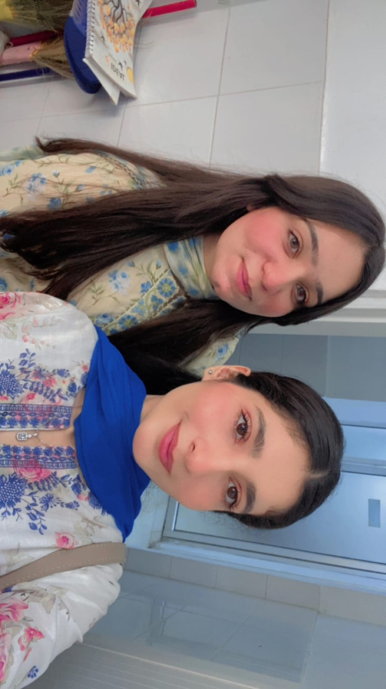
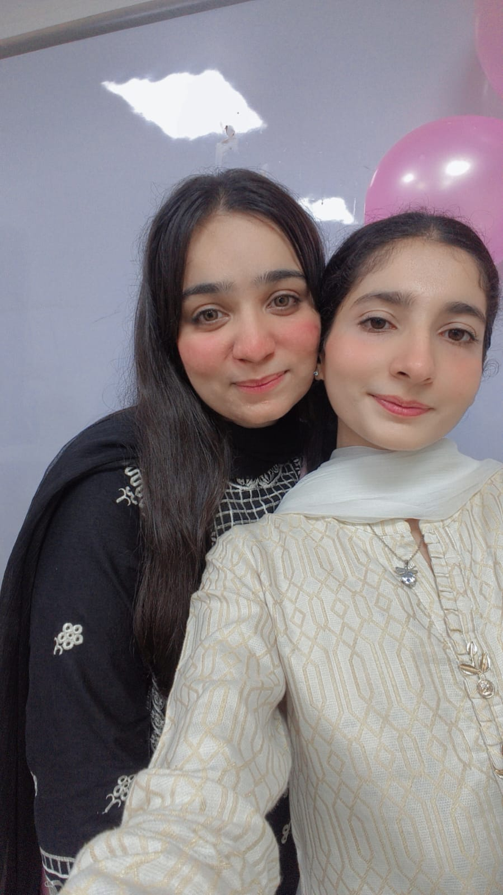
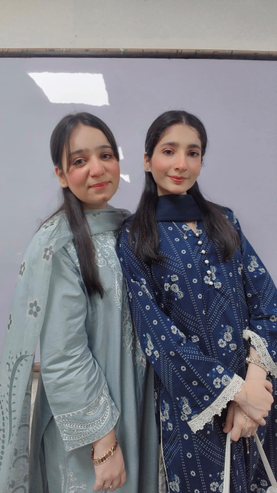

<!DOCTYPE html>
<html lang="en">
<head>
<meta charset="UTF-8">
<meta name="viewport" content="width=device-width, initial-scale=1.0">
<title>For Aleena 💖</title>

</head>

<body>

<h1>💖 Hi Aleena 💖</h1>

You make every moment special ✨

<button onclick="nextPage('page2')">
Open Memories 🌸
</button>

<h1>💗 Our Memories 💗</h1>

<button onclick="nextPage('page3')">
Love Notes 💌
</button>

<h1>💕 Cute Notes 💕</h1>

Aleena you're amazing ❤️

Thank you for always being there ✨

Forever memories 💖

<button onclick="nextPage('page4')">
Open Gift 🎁
</button>

<h1>Special Gift 💝</h1>

🎁

<h2>💖</h2>

<h3>
Aleena, will you be my best friend forever?
</h3>

<button onclick="yes()">
Yes 💕
</button>

<button onclick="no()">
No 😒
</button>

</body>
</html>
